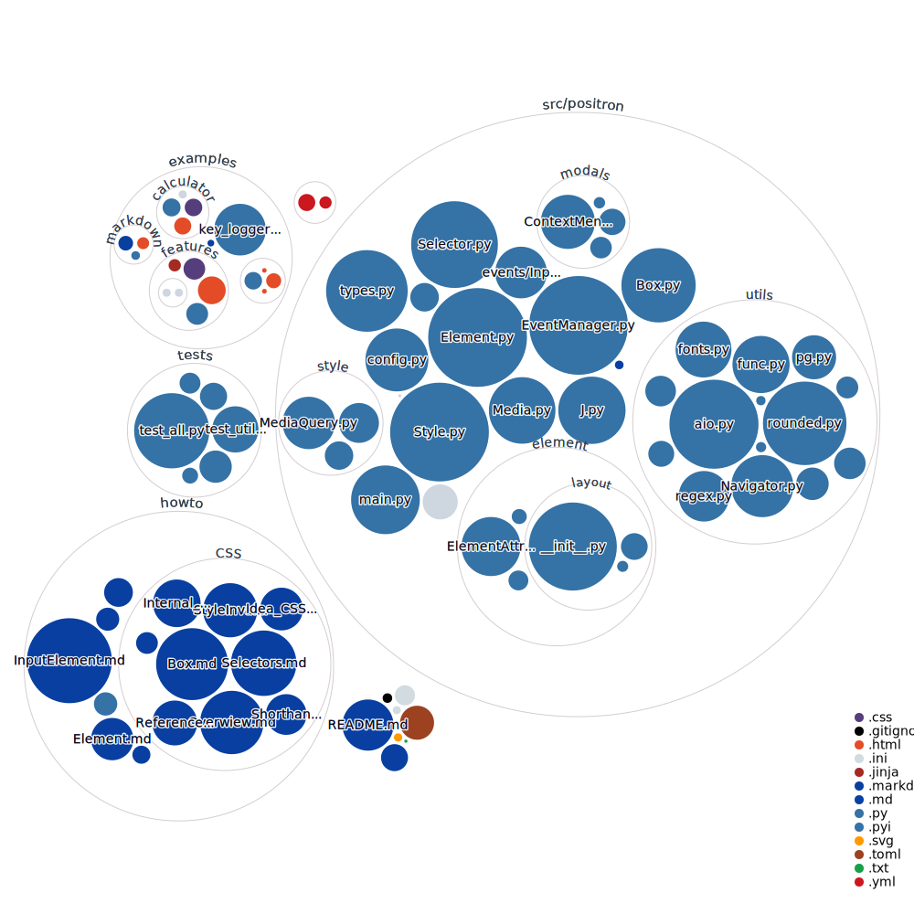

[](https://gitter.im/Positron-Contributors/community?utm_source=badge&utm_medium=badge&utm_campaign=pr-badge&utm_content=badge)
[](https://github.com/psf/black)


# Positron

**E**lectron uses **E**CMAScript and **P**ositron uses **P**ython

> I initially thought the name was really brilliant and original until I randomly searched for Positron and found like 5 other projects with the same name. One of them an Electron clone by Mozilla 😂.

# Motivation

When you use Python and you want to visualize something you have following routes:
1. `tkinter` or other GUI libraries like `QT`
2. `matplotlib`
3. Creating an HTML file and opening it in the default browser. 

If you however want to have the feel of a real system application then you will need to use a "real" GUI library. An alternative is using Electron that calls python code. However, the problems of Electron are well known. 

Specifically, Electron creates a server and a Chromium client that communicate per IPC. This makes Electron both relatively slow and also it uses **huge** amounts of memory. Apps that use Electron like VSCode or Discord pretty quickly add up to GBs of RAM usage. 4GB vanish quickly when you for example have 2 Browsers and 2 Electron apps open. When the OS has little RAM left it will start swapping RAM in and out of disk and this will make your whole computer lag a lot.

Also, Electron has pretty slow load times. If you start any other regular app (a Flutter app for example), it seems like it opens almost instantly. However, Electron takes a few seconds to load and it really becomes obvious to the user. 

Apart from this little thing, Electron is really great, if you know how to use it.

## How can Positron be fast with Python?

1. Most of the work is done in C: IO, graphics, and calculations
2. Asynchronous programming

Thats really it.

# Screen cast

This code
#### example.html
```html
<title>Document</title>
<style>
    body {
        margin-left: 100px;
    }
    a:hover {
        color: green;
    }
    button {
        display: block;
    }
</style>

<p>
    <a href="/secondpage">
        Second page
    </a>
</p>
<button>Click Me!</button>
```
#### example.jinja
```html
<h1>Second Page</h1>
<a href="/">Back</a>
```
#### main.py
```python	
@add_route("/")  # the index route
def startpage():
    load_dom("example.html")

    colors = ["red", "green", "lightblue", "yellow"]

    def button_callback(event):
        color = colors.pop(0)
        colors.append(color)
        event.target.set_style("background-color", color)

    J("button").on("click", button_callback)

@add_route("/secondpage")
def nextpage():
    load_dom("example.jinja")
```
creates this result  

[](https://www.youtube.com/watch?v=rDf5UI9oLa8)

# How to run this
You need Python 3.10 and Git installed
```shell
git clone https://github.com/theRealProHacker/Positron.git
cd Positron
python3 -m venv venv
venv\Scripts\activate   &:: on Windows
venv/bin/activate       # on Unix 
pip install -r requirements.txt
cd positron
```
Now you can create an HTML-file `example.html` in `positron` and then you just do  
```shell
python3 main.py
```

# Visualization of the codebase
Uses [repo-visualization](https://githubnext.com/projects/repo-visualization/) by [Amelia Wattenberger](https://wattenberger.com/)


# Sources 
## MVPs
- [MDN](developer.mozilla.org)
- [The official HTML specifications](html.spec.whatwg.org)
- [How Browsers work](https://web.dev/howbrowserswork/)
- [Web Browser Engineering](https://browser.engineering/)
- Just to be honest [StackOverflow](https://stackoverflow.com)
## Single sources
- https://runebook.dev/en/docs/css/css_flow_layout/block_and_inline_layout_in_normal_flow
- https://hacks.mozilla.org/2017/08/inside-a-super-fast-css-engine-quantum-css-aka-stylo/
- [Parsing](https://html.spec.whatwg.org/multipage/parsing.html)
- [Firefox Source Structure](https://firefox-source-docs.mozilla.org/contributing/directory_structure.html)
- [Gamma Correction](https://blog.johnnovak.net/2016/09/21/what-every-coder-should-know-about-gamma/)

# Thoughts
## General Style Guide
1. There is an inner conflict between confirmacy to the Web Standards and practicality. 
    1. We try to implement everything as close to the standards as possible, 
    2. But we don't implement deprecated features or features that are not implemented by most mainstream browsers.
    3. If the standards are ridiculous in some aspects, we go our own way, unless someone finds a good reason not to. 
    4. We don't implement JavaScript, and we don't need to feel forced to even follow the standards for JavaScript when implementing Python APIs. However, it might still help to look at the JS standards for inspiration.
2. In GUI Applications its all about what the user feels. It doesn't matter if your code takes 10 seconds to run, unless the user feels it. If you run that code synchronously and the application freezes for 10 seconds, the user will feel it. If you run it asynchronously, and put in a loading sign the user will still see that it takes some time, but he won't care because he expects that things need time to load. Please just only write asynchronous code!

## Async
To achieve asynchronous code you need two methods:
1. `asyncio.to_thread` two turn a synchronous function into an asynchronous one
2. `util.create_task` to "fire and forget" a coroutine. You can make it `sync` which just means that before the page loads the task will definitely have finished. Also you can add an onfinished callback. 

## Ideas
- Test on https://acid2.acidtests.org/  
- `tinycss` generates tokens like for example `<Token PERCENTAGE at 5:19 70%>`, we could use these. Right now we throw them away by calling `TokenList.as_css()`  
- Use [aiohttp-client-cache](https://github.com/requests-cache/aiohttp-client-cache)
- animated GIF support (https://yeahexp.com/how-to-insert-animated-gif-into-pygame/)
- `@when` and `@else` in CSS: https://css-tricks.com/proposal-for-css-when/
- Profiling: 
    - https://www.youtube.com/watch?v=m_a0fN48Alw
    - https://pythonspot.com/python-profiling/
- Text Search (Ctrl+F)
- [`alpine.js`](https://alpinejs.dev/) port

## Use less RegEx
Many consider regular expressions to be the best thing if it comes to text processing. 
However, it often makes more sense to use other tools.  
For exampe you could use a `GeneralParser`, which is an easy way to tokenize a string.

# Events
## Mouse Events
- [`click`](https://w3c.github.io/uievents/#click) and [`auxclick`](https://w3c.github.io/uievents/#auxclick):
    - target: The Element clicked (bubbles)
    - pos: the mouse position on the screen
    - mods: An int mask, which mods are pressed
    - button: invalid: 0, left: 1, middle: 2, right: 3; 4 and 5 are special buttons
    - buttons: A bit mask of which mouse buttons are down
    - detail: Which click this is. The 1st, 2nd, 3rd, ... 
- `mousedown`:
    - target: The Element the mouse was pressed in
    - pos
    - mods
    - buttons
- `mouseup`:
    - target: The Element the mouse was released in
    - pos
    - mods
    - buttons
- `mousemove`:
    - target: The Element the mouse was moved in
    - pos: the new mouse position
    - mods
    - buttons
- `wheel`:
    - target
    - pos
    - mods
    - buttons
    - delta: The x and y delta of the mouse wheel event
- Coming: `mouseleave`/`mouseout` and `mouseenter`/`mouseover`

## Keyboard Events
TODO
- keydown:
    - 
- keyup:
    - 

## Window Events and Global Events
Window Events only fire on the html element/the document. So call them by doing `event_manager.on(event, callback)` or `J("html").on(event, callback)`.  
- `online` and `offline` with no attributes
- `resize`: 
    - size = (width,height)
- All other pygame events (except for `WINDOWRESIZED`) lowercased.  
The arguments of the event are copied from pygame, so look into the [documentation](https://www.pygame.org/docs/ref/event.html)

## Documented differences to the specifications
### CSS
1. Numbers in CSS can be written with a trailing `.`  
Example: `line-height: 1.`
2. In CSS `-10` is parsed as the minus sign and a number token. However, I consider this a bug and it causes so many problems all over the place (`calc(12px+-10px)` is invalid and not parsed as (`12px`)`+`(`-10px`) which totally goes against the rule of maximally valid output from minimally valid input). Instead, parsing should be dependant on the context. 
3. `margin: 0 0 inherit inherit` is also valid and maps to 
```css
margin-top:     0;
margin-left:    0;
margin-bottom:  inherit;
margin-right:   inherit;
```
4. Also if any of the four values in `margin` were invalid, the rest would still be accepted.
5. URLs can generally also be absolute or relative paths. `file`-URLs are not accepted

### HTML
- Many attributes like `srcset`, `cors` or `referer` are just unnecessary
- Additionally, many `width` and `height` attributes will be ignored in favor of using css styling. 
- `a`-Elements ignore `target`
- `html` has its size set to the screens size (`body{height:100%}` works)
- any `aria` attributes are ignored right now. 
- To link CSS you can just use style tags. `<style src="style.css"></style>`
    - [Why]https://youtu.be/zyNhxN6sToM?t=415

# Rants
## Why Python is definitely better then JS
From https://stackoverflow.com/a/2346626/15046005
> technically javascript to python would be a decompiler

From https://www.youtube.com/watch?v=G9QTBS2x8U4
> JavaScript Was So Bad They Had To Add A Second Mode To Fix It

From https://www.youtube.com/watch?v=aXOChLn5ZdQ&lc=UgzA0qq1X45-ZU337eR4AaABAg
> When you code in JS, you always want to shout "F%ck this", but you can't be sure what "this" means in your local environment...

## Why the CSS-Specifications are pretty bad
1. Many Inconsistencies. Very similar concepts have totally different syntaxes. 
    Simple example: `rgb` and `hwb`  
2. Sometimes the specifications were done respecting the implementors but then somewhere else they don't care about those at all and then you see CSS-'Features' that are not supported by a single browser.
3. Because CSS was sometimes tailored to very old hardware or other almost ancient circumstances, it has a lot of technical debt. Another reason for this is that just like HTML and JS, CSS cannot have breaking changes, even if totally necessary. 
For example there are a million ways to say the same thing in CSS (colors, tranparency)
4. But in general, CSS is a simple and effective language to describe how a webpage should look like. 
5. Additionally, Positron has an advantage because it firstly doesn't need to support every feature or every device, currently. And secondly, anyone designing a desktop app with it doesn't need to care about supporting IE7 or similar, in contrast to some actual web-developers. 

# But actually

## ES6 is a pretty well rounded language with at least two features that Python developers are probably jealous of
1. object unpacking
```js
my_object = {
    "a": 1,
    "b": 2,
}
{a,b} = my_object
```
2. anonomous functions that are actual functions
```js
inc = x => x+1
```
Python only has ugly lambdas
```python
inc = lambda x: x+1
```
This might not seem like that big of a difference, but it is, when callbacks become bigger
```js
window.onload = ()=>{
    console.log("loaded")
    x = 5
    console.log(`I can do whatever I want in these anonymous functions $x`)
    x += 1;
    console.log("x is now", x)
}
```
This is not possible in Python, which makes me at least jealous.
However, there is a pretty solid workaround for this using python decorators. 
```python	
@window.onload
def _():
    print("loaded)
    x = 5
    print(f'I can do whatever I want in these anonymous functions {x}')
    x += 1;
    print("x is now", x)
```	

## the web specs are good too
I like how there is this balance between parties and interests.

First, you have web developers, second you have the spec authors and then you have the implementors. In some way you can think of these as the three powers of political systems. 
1. L: spec authors
2. E: implementors
3. J: web developers

> Note: Obviously, a single person can have several roles. So one person could be a web developer and also an implementor.

The similarities might not be obvious but one example is how spec authors ask implementors before they adopt new "laws". However, one big difference is that implementors are independent and do **not** have to follow the "laws". Which is obviously totally different to the real world metaphor, however most laws are abided by. 
And again, web developers have no real power. They can only put pressure on the other two parties. But apart from their powerlessness, they perfectly fit the role of judge. They judge the other results and give feedback like spec issues, implementation bugs and missing features. 
